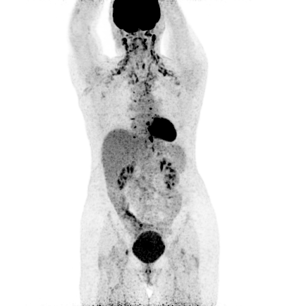
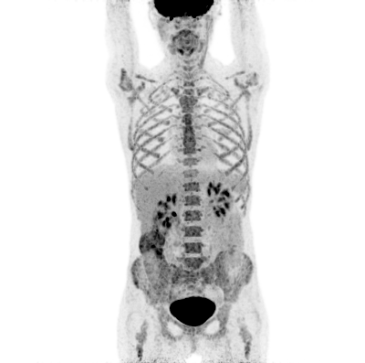
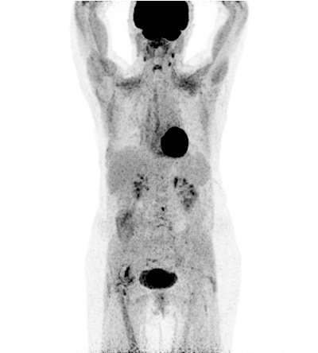
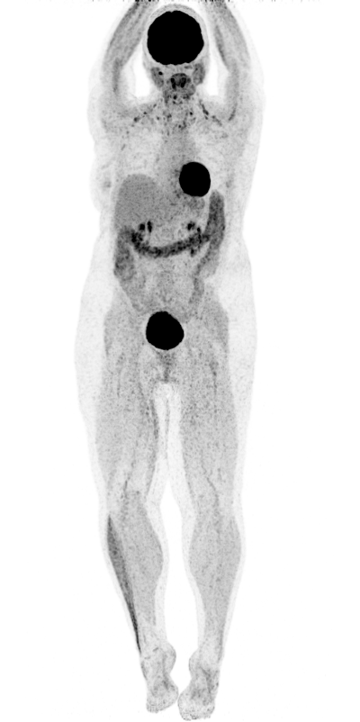

# Tumor Segmentation

**Use case**: Automated tumor detection and segmentation in medical images.

**Description**: This API accepts medical image data and returns a segmentation mask with classification results, supporting automated and accurate tumor detection.

## Quick Start

1. **Navigate to the segmentation directory:**

   ```bash
   cd segmentation
   ```

1. **Install dependencies:**

   ```bash
   uv sync
   ```

1. **Test the baseline model:**

   ```bash
   uv run python example.py
   ```

## Validation

Submit your solution for validation:

```bash
# Submit for validation
uv run validate

# Check validation status
uv run check-status <uuid>

# Submit and wait for completion
uv run validate --wait
```

## API Testing

The unified API serves all tasks with auto port cleanup and hot reload:

```bash
cd ../shared
uv sync       # Install all API dependencies
uv run api    # Start API with auto port cleanup
```

**Features:**

- ✅ **Auto port cleanup** - Kills any existing process on port 8000
- ✅ **Hot reload** - Automatically restarts when code changes
- ✅ **All dependencies** - Includes FastAPI, NumPy, Loguru, and more

Test the tumor segmentation endpoint at `http://localhost:8000/tumor/predict`:

```bash
curl -X POST http://localhost:8000/tumor/predict \
     -H "Content-Type: application/json" \
     -d '{"img": "base64-encoded-image-data"}'
```

**Expected Response:**

```json
{"img": "base64-encoded-segmentation-mask"}
```

## MIP-PET

MIP-PET is short for Maximum-Intensity-Projected Positron Emission Tomography. Positron Emission Tomography (PET) is a medical imaging modality often used for diagnosing and monitoring cancer patients. By scanning a person in a PET-scanner you obtain a volumetric image, which is an image that has three dimensions. Each pixel value in this 3D image reflects, roughly, how much sugar is consumed in that particular part of the body. Since tumors have a high growth rate, they require a lot sugar, and the corresponding pixels thus attain high pixel values in the PET image. Working with 3D images requires a lot of memory, so to reduce the data dimensionality a 2D Maximum Intensity Projected (MIP) can be created by doing a "max"-operation along one dimension of the PET image:

```
mip_pet = np.max(pet,axis=1)
```

Intuitively, the MIP operation on PET images can be imagined visually as shining a light through a semi-transparent patient and recording the shadow on the other side (the patient opacity is determined by the sugar consumption).

You can read more about PET on [wikipedia](https://en.wikipedia.org/wiki/Positron_emission_tomography).

### Interpreting MIP-PET

Note that some areas of the body will have high sugar consumption even if there is no cancer.
The following organs have high sugar consumption:

- Brain
- Bladder
- Kidneys
- Heart
- Liver

Some patient factors can lead to increased sugar consumption in parts of the body. Common factors are:

- Constipation
- Forgetting to fast before the scan
- Recent chemotherapy or surgery
- Being cold during the scan

Consequently, it can be difficult to determine whether an area of high sugar uptake is caused by cancer or something else. Here are a few examples of healthy controls that exhibit tricky sugar consumption which could be misinterpreted as cancer. Also note how the brain, bladder, heart, and kidneys almost always have a high sugar uptake.
validate_segmentation

<table>
  <tr>
    <td>   </td>
    <td>  <h3>Control 50</h3> <p>Symmetric high sugar consumption around neck and esophagus, usually caused by the patient being too cold during the scan.</p></td>
   </tr> 
  <tr>
    <td>   </td>
    <td>  <h3>Control 399</h3> <p>Uniform high sugar consumption in the bones, usually caused by recent chemotherapy or other treatment.
</p></td>
   </tr> 
    <tr>
    <td>   </td>
    <td>  <h3>Control 381</h3> <p>Slightly increased sugar consumption in the upper body muscles, usually caused by the subject forgetting to fast before the scan.
</p></td>
   </tr> 
    <tr>
    <td>   </td>
    <td>  <h3>Control 398</h3> <p>High sugar consumption in the colon, usually caused by constipation.
</p></td>
   </tr> 
</table>

## Segmentation format

Your model is expected to return a segmentation in the form of an rgb image with only white (255,255,255) and black (0,0,0) pixels. White pixels indicate tumor areas and black pixels indicate healthy areas. The segmentation image should have the same shape as the input MIP-PET image. The python function `validate_segmentation` in `utils.py` will help you check if your segmentation prediction is valid.

### Baseline model

We have implemented a simple threshold baseline model in `example.py` along with the boilerplate code needed to deploy the model as an endpoint:

```python
def predict(img: np.ndarray) -> np.ndarray:
    logger.info(f"Received image: {img.shape}")
    threshold = 50
    segmentation = get_threshold_segmentation(img, threshold)
    return segmentation


def get_threshold_segmentation(img: np.ndarray, threshold: int) -> np.ndarray:
    return (img < threshold).astype(np.uint8) * 255
```

To use your own model, simply replace the call to `get_threshold_segmentation` with a call to the inference function of your model.

## Validation and Evaluation

Both the validation set and the test set each contain 200 samples of patients with cancer. **There are no healthy controls in the validation or test set**.
The images have a maximum width of 400 px and a maximum height of 991 pixels. **You have 10 seconds to return your predictions for each image.**
During the week of the competition, you will be able to validate your solution against the validation set. You can do this multiple times, however, **you can only submit to the test/evaluation set once!** The best validation and test score your model achieves will be displayed on the <a href="https://cases.dmiai.dk/teams"> scoreboard</a> . We encourage you to validate your code and API before you submit your final model to evaluation.

The evaluation opens up on THursday the 7th at 12:00 CET. You will not be able to evaluate before then.

### Scoring

Your segmentations will be scored via the [Dice-Sørensen coefficient](https://en.wikipedia.org/wiki/S%C3%B8rensen%E2%80%93Dice_coefficient) which is in the range [0-1], with 1 being the best:

$$
dice=\\frac{2 \\cdot TP }{2 \\cdot TP +FP+FN}
$$
$$
\\begin{aligned}
&TP:(\\text{True Positive}): &\\text{Number of correctly predicted tumor pixels}\\
&FP:(\\text{False Positive})+FN:(\\text{False Negative}):& \\text{Number of incorrectly predicted pixels}\\
\\end{aligned}
$$

See below for an example segmentation prediction and dice score.

<p align="center">
  
</p>

## Quickstart

```cmd
git clone https://github.com/amboltio/DM-i-AI-2025
cd DM-i-AI-2024/race-car
```

Install dependencies

```cmd
pip install -r requirements.txt
```

### Serve your endpoint

Serve your endpoint locally and test that everything starts without errors

```cmd
cd tumor-segmentation
python api.py
```

Open a browser and navigate to http://localhost:9051. You should see a message stating that the endpoint is running.
Feel free to change the `HOST` and `PORT` settings in `api.py`.
