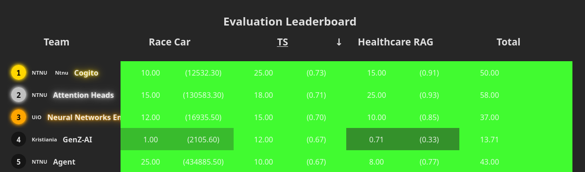

# 🧠 Tumor Segmentation API

**Use case:** Automated tumor detection and segmentation in medical images (MIP-PET scans).

**Goal:** Provide an API that returns precise segmentation masks and classification results to support faster and more reliable tumor detection.

## 🚀 What Our Best Models Achieved

Our top-performing solution was built from **three optimized UNet models** (`efficientnet-b3` backbone with SCSE attention) trained using cross-validation on 4 folds.
Key highlights:

- **Training setup:** Google Colab with 4-fold cross-validation and extensive image augmentations.
- **Best folds:**
  - `segmentation/train_unet_fold0_v471.ipynb`
  - `segmentation/train_unet_fold2_v377.ipynb`
  - `segmentation/train_unet_fold3_v137.ipynb`
- **Ensembling strategy:** **Bagging + Test Time Augmentation (TTA)** to combine predictions from all three folds.
- **Result:** Consistently **high Dice scores** on validation and test sets, achieving an average Dice score of **0.73** on the test set.



See the [leaderboard](https://cases.ainm.no/)

## 📂 Dataset Structure

We used Google Colab to train our models on the Tumor Segmentation dataset. The notebooks can be retrained there by uploading them as well as the data to Google Drive. And set WANDB_API_KEY in Google Colab
To retrain using google Colab, place the `data` folder at the root of your Google Drive with the following structure:

```
data
├── raw
│   ├── tumor-segmentation
│   │   ├── controls
│   │   │   ├── imgs
│   │   │   └── labels
│   │   ├── patients
│   │   │   ├── imgs
│   │   │   └── labels
```

One can also change the `PATIENTS_DIR` and `CONTROLS_DIR` variables in the `segmentation/train_unet_fold*.ipynb` notebooks to point to the correct location of the data. Or to run local training points to the relative path of the `data` folder.
Then one also needs to load the WANDB_API_KEY from the env

```python
from google.colab import userdata

WANDB_API_KEY = userdata.get("WANDB_API_KEY")
```

Must be changed to:

```python
from dotenv import load_dotenv
import os

load_dotenv()
WANDB_API_KEY = os.getenv("WANDB_API_KEY")
```

## 🛠 Model Inference

Our inference pipeline:

1. **Load ensemble models as Singleton** from Weights & Biases artifacts.
1. **Resize & normalize** input MIP-PET image.
1. Apply **TTA** (identity, horizontal flip, vertical flip, HV flip).
1. Predict per model → **average** predictions across models and augmentations.
1. **Threshold** probability map to generate binary tumor mask.

## 🧩 Training Details

- **Architecture:** UNet + `efficientnet-b3` encoder + SCSE attention
- **Augmentations:** Upsize all images, flips, brightness/contrast adjustment, Gaussian blur, noise, Salt & Pepper noise
- **Loss:** Dice Loss
- **Optimizer:** AdamW with Cosine Annealing LR
- **Ensemble:** Best fold from each selected training run
- **TTA:** Horizontal, vertical, and combined flips

## 📈 Why Our Models Worked Well

✅ **Cross-validation & ensembling** → reduced overfitting and improved generalization
✅ **TTA** → made predictions more robust to spatial variance
✅ **Strong backbone (EfficientNet-B3)** → learned rich semantic features from PET images
✅ **Attention in decoder** → improved focus on relevant tumor regions
✅ **Aggressive augmentations** → improved resilience to scan variability

## ⚡ Quick Start

To quickly set up and run the Tumor Segmentation API, follow these steps:

1. **Navigate to segmentation directory:**

   ```bash
   cd segmentation
   ```

1. **Create `.env` file:**

   ```bash
   cp .env.example .env
   ```

   - `.env` specifies which models to load in the API.
   - The provided `.env.example` is set up with our **best ensemble models**.
   - Requires a valid **WANDB API key** to download models directly.

1. **Install dependencies:**

   ```bash
   uv sync
   ```

1. **Run the API locally:**

   ```bash
   uv run api.py
   ```

1. **Test with a sample request:**

   ```bash
   uv run client_test.py
   ```

   You’ll see the segmentation result saved in the `segmentation` folder.

### 📥 Downloading Models without Wandb

Using git lfs one can also download the models directly from the repository:

```bash
git lfs install
git lfs pull
```

## Validation Using Pinggy Tunnel

To properly validate your local Tumor Segmentation server against the Norwegian AI Championship competition server, follow these steps:

### 1. Run the Server Locally

From your project root (e.g., `tumor-segmentation` folder), start the Tumor Segmentation API server:

```bash
uv run api.py
```

This will start the server locally at `http://localhost:9051`.

### 1.5. Monitor Server Logs

To follow the server logs in real-time:

```bash
tail -f logs/api.log
```

### 2. Open a New Terminal

In a separate terminal window, navigate to the project directory where you want to run validation commands.

### 3. Create a Pinggy Tunnel

Use SSH to expose your local port 9051 to the internet via Pinggy:

```bash
ssh -p 443 -R0:localhost:9051 free.pinggy.io
```

Replace `9051` with the port your service is listening on if different.

- The tunnel will allocate a public HTTPS URL forwarding to your local service.
- Keep this terminal open as long as the tunnel should remain active.

### 4. Use the Pinggy URL For Validation

Go to the Norwegian AI Championship website: [https://cases.ainm.no/](https://cases.ainm.no/)

- Navigate to the task you are working on (e.g., Tumor Segmentation).
- Paste your Pinggy HTTPS URL (e.g., `https://rnxtd-....a.free.pinggy.link/predict`) as the endpoint URL.
- Enter your competition token.
- Submit the evaluation request.

### 5. Monitor Validation Results

- The remote competition server will send test queries to your exposed endpoint.
- You can monitor logs locally and check the scoreboard.

**Benefits of this method:**

- Your server runs locally with all optimizations.
- The competition server accesses your system reliably via HTTPS.
- You avoid issues with local-only or cached API instances.
- Validation runs smoothly and reflects your optimized model performance.

## MIP-PET

MIP-PET is short for Maximum-Intensity-Projected Positron Emission Tomography. Positron Emission Tomography (PET) is a medical imaging modality often used for diagnosing and monitoring cancer patients. By scanning a person in a PET-scanner you obtain a volumetric image, which is an image that has three dimensions. Each pixel value in this 3D image reflects, roughly, how much sugar is consumed in that particular part of the body. Since tumors have a high growth rate, they require a lot sugar, and the corresponding pixels thus attain high pixel values in the PET image. Working with 3D images requires a lot of memory, so to reduce the data dimensionality a 2D Maximum Intensity Projected (MIP) can be created by doing a "max"-operation along one dimension of the PET image:

```
mip_pet = np.max(pet,axis=1)
```

Intuitively, the MIP operation on PET images can be imagined visually as shining a light through a semi-transparent patient and recording the shadow on the other side (the patient opacity is determined by the sugar consumption).

You can read more about PET on [wikipedia](https://en.wikipedia.org/wiki/Positron_emission_tomography).

### Interpreting MIP-PET

Note that some areas of the body will have high sugar consumption even if there is no cancer.
The following organs have high sugar consumption:

- Brain
- Bladder
- Kidneys
- Heart
- Liver

Some patient factors can lead to increased sugar consumption in parts of the body. Common factors are:

- Constipation
- Forgetting to fast before the scan
- Recent chemotherapy or surgery
- Being cold during the scan

Consequently, it can be difficult to determine whether an area of high sugar uptake is caused by cancer or something else. Here are a few examples of healthy controls that exhibit tricky sugar consumption which could be misinterpreted as cancer. Also note how the brain, bladder, heart, and kidneys almost always have a high sugar uptake.
validate_segmentation

<table>
  <tr>
    <td>   </td>
    <td>  <h3>Control 50</h3> <p>Symmetric high sugar consumption around neck and esophagus, usually caused by the patient being too cold during the scan.</p></td>
   </tr>
  <tr>
    <td>   </td>
    <td>  <h3>Control 399</h3> <p>Uniform high sugar consumption in the bones, usually caused by recent chemotherapy or other treatment.
</p></td>
   </tr>
    <tr>
    <td>   </td>
    <td>  <h3>Control 381</h3> <p>Slightly increased sugar consumption in the upper body muscles, usually caused by the subject forgetting to fast before the scan.
</p></td>
   </tr>
    <tr>
    <td>   </td>
    <td>  <h3>Control 398</h3> <p>High sugar consumption in the colon, usually caused by constipation.
</p></td>
   </tr>
</table>

## Segmentation format

Your model is expected to return a segmentation in the form of an rgb image with only white (255,255,255) and black (0,0,0) pixels. White pixels indicate tumor areas and black pixels indicate healthy areas. The segmentation image should have the same shape as the input MIP-PET image. The python function `validate_segmentation` in `utils.py` will help you check if your segmentation prediction is valid.

### Baseline model

We have implemented a simple threshold baseline model in `example.py` along with the boilerplate code needed to deploy the model as an endpoint:

```python
def predict(img: np.ndarray) -> np.ndarray:
    logger.info(f"Received image: {img.shape}")
    threshold = 50
    segmentation = get_threshold_segmentation(img, threshold)
    return segmentation


def get_threshold_segmentation(img: np.ndarray, threshold: int) -> np.ndarray:
    return (img < threshold).astype(np.uint8) * 255
```

To use your own model, simply replace the call to `get_threshold_segmentation` with a call to the inference function of your model.

## Validation and Evaluation

Both the validation set and the test set each contain 200 samples of patients with cancer. **There are no healthy controls in the validation or test set**.
The images have a maximum width of 400 px and a maximum height of 991 pixels. **You have 10 seconds to return your predictions for each image.**
During the week of the competition, you will be able to validate your solution against the validation set. You can do this multiple times, however, **you can only submit to the test/evaluation set once!** The best validation and test score your model achieves will be displayed on the <a href="https://cases.dmiai.dk/teams"> scoreboard</a> . We encourage you to validate your code and API before you submit your final model to evaluation.

The evaluation opens up on THursday the 7th at 12:00 CET. You will not be able to evaluate before then.

### Scoring

Your segmentations will be scored via the [Dice-Sørensen coefficient](https://en.wikipedia.org/wiki/S%C3%B8rensen%E2%80%93Dice_coefficient) which is in the range [0-1], with 1 being the best:

$$
dice=\\frac{2 \\cdot TP }{2 \\cdot TP +FP+FN}
$$

$$
\\begin{aligned}
&TP:(\\text{True Positive}): &\\text{Number of correctly predicted tumor pixels}\\
&FP:(\\text{False Positive})+FN:(\\text{False Negative}):& \\text{Number of incorrectly predicted pixels}\\
\\end{aligned}
$$

See below for an example segmentation prediction and dice score.

<p align="center">
  
</p>
