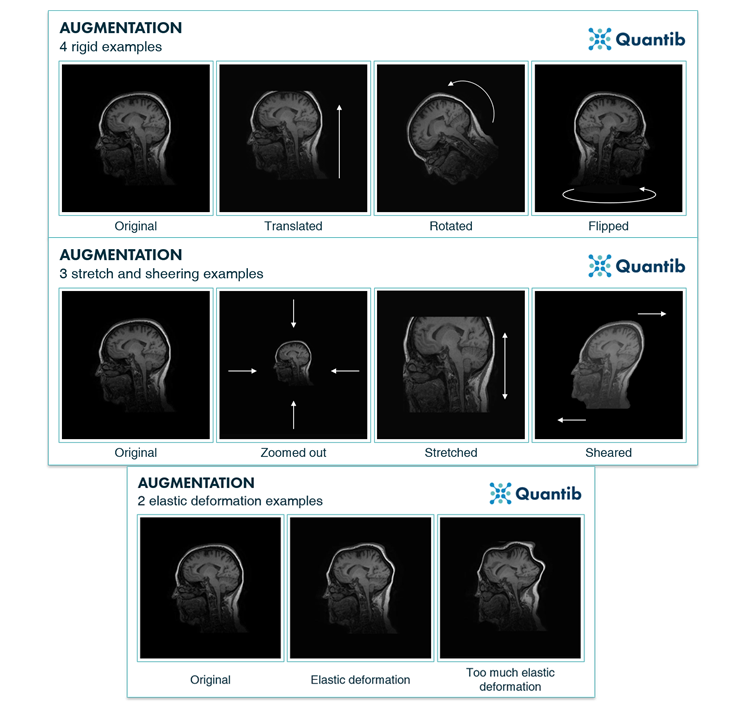

# Architectures and Data Augmentations for MIP-PET scans

## Useful articles

### [Image Segmentation - A Beginner's Guide](https://medium.com/@raj.pulapakura/image-segmentation-a-beginners-guide-0ede91052db7)

Faktisk beginner's guide, med en liten intro til ulike typer segmentation, og u-net, bl.a.

### [Segmentation: U-Net, Mask R-CNN, and Medical Applications](https://glassboxmedicine.com/2020/01/21/segmentation-u-net-mask-r-cnn-and-medical-applications/)

## Strong architectures

The following architectures are commonly used for image segmentation tasks, especially in medical imaging, to gain easy access to state-of-the-art models and their implementations use the [MONAI framework](https://docs.monai.io/en/stable/networks.html#nets).:

### [U-Net](http://arxiv.org/pdf/1505.04597)

### [SegNet](https://arxiv.org/pdf/1511.00561)

### [Mask R-CNN](https://arxiv.org/pdf/1703.06870)

### [PSPNet](https://arxiv.org/pdf/1612.01105)

### [SwinUNETR](https://docs.monai.io/en/stable/networks.html#swinunetr)

## Data augmentations

